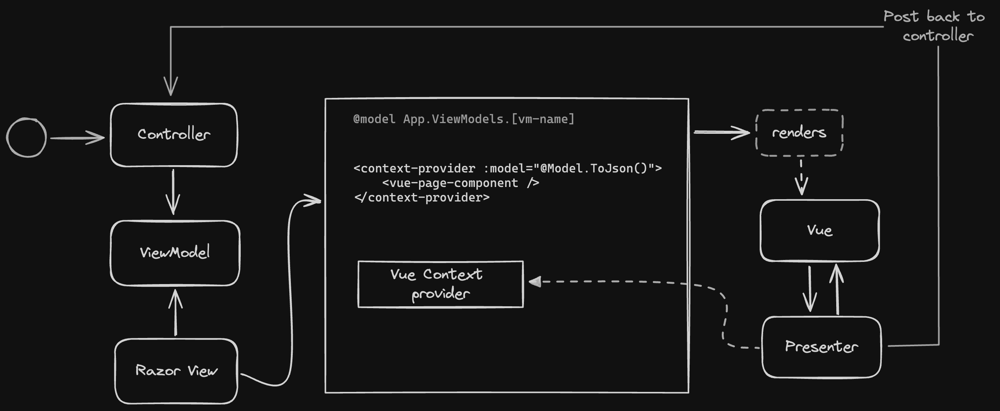

### Vue 3 inside a .NET MVC application. (SSR, no SPA)

#### Primary files of interest
```sh
/src/main.ts

/Views/Shared/_Layout.cshtml

/Views/Home/Index.cshtml
```

#### Architecture



#### Install front-end modules:
```sh
$ npm install
```

#### Run front-end and watch for changes (port 5555)
```
npm run dev
```

#### Run dotnet back-end
```sh
$ dotnet run
```

#### Auto-generate TypeScript models from C# classes
```sh
$ dotnet typegen generate
```


#### Credits
- Jannik Maag (Fuzzypawzz)
- Evgenios Pampoukos (Evgenios95)